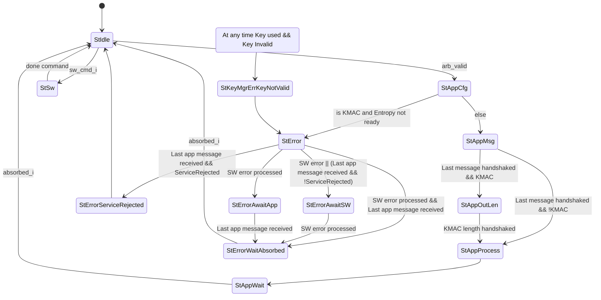
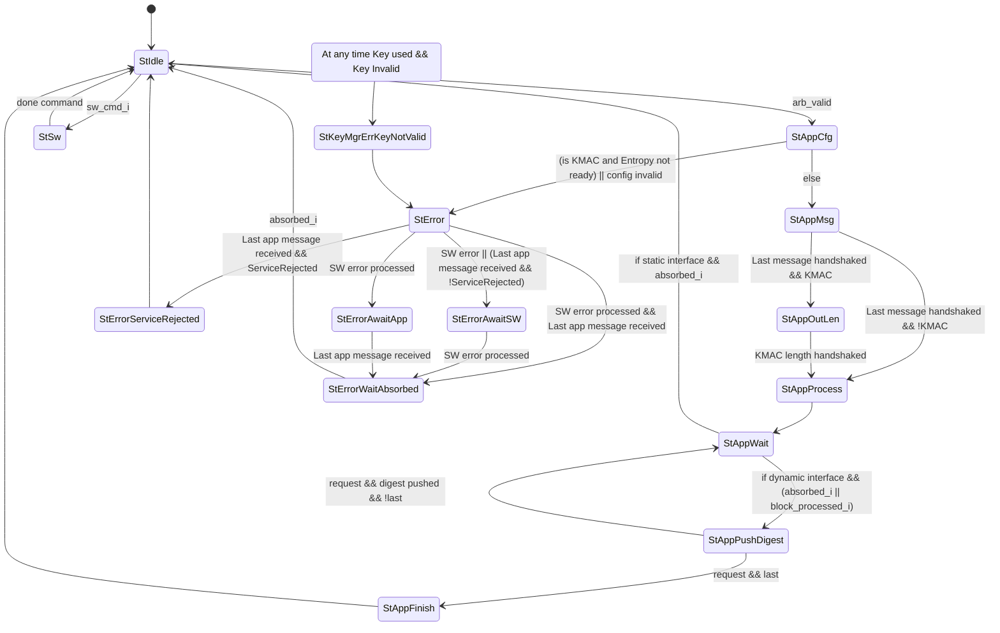

# Theory of Operation

## Block Diagram


The above figure shows the KMAC/SHA3 HWIP block diagram.
The KMAC has register interfaces for SW to configure the module, initiate the hashing process, and acquire the result digest from the STATE memory region.
It also has an interface to the KeyMgr to get the secret key (masked).
The IP has N x [application interfaces](#application-interface), which allows other HWIPs to request any pre-defined hashing operations.

As similar with HMAC, KMAC HWIP also has a message FIFO (MSG_FIFO) whose depth was determined based on a few criteria such as the register interface width, and its latency, the latency of hashing algorithm (Keccak).
Based on the given criteria, the MSG_FIFO depth was determined to store the incoming message while the SHA3 core is in computation.

The MSG_FIFO has a packer in front.
It packs any partial writes into the size of internal datapath (64bit) and stores in MSG_FIFO.
It frees the software from having to align the messages.
It also doesn't need the message length information.

The fed messages go into the KMAC core regardless of KMAC enabled or not.
The KMAC core forwards the messages to SHA3 core in case KMAC hash functionality is disabled.
KMAC core prepends the encoded secret key as described in the SHA3 Derived Functions specification.
It is expected that the software writes the encoded output length at the end of the message.
For hashing operations triggered by an IP through the application interface, the encoded output length is appended inside the AppIntf module in the KMAC HWIP.

The SHA3 core is the main Keccak processing module.
It supports SHA3 hashing functions, SHAKE128, SHAKE256 extended output functions, and also cSHAKE128, cSHAKE256 functions in order to support KMAC operation.
To support multiple hashing functions, it has the padding logic inside.
The padding logic mainly pads the predefined bits at the end of the message and also performs `pad10*1()` function.
If cSHAKE mode is set, the padding logic also prepends the encoded function name `N` and the customization string `S` prior to the incoming messages according to the spec requirements.

Both the internal state width and the masking of the Keccak core are configurable via compile-time Verilog parameters.
By default, 1600 bits of internal state are used and stored in two shares (1st order masking).
The masked Keccak core takes 4 clock cycles per round if sufficient entropy is available.
If desired, the masking can be disabled and the internal state width can be reduced to 25, 50, or 100 bits at compile time.

## Design Details

### Keccak Round

A Keccak round implements the Keccak_f function described in the SHA3 specification.
Keccak round logic in KMAC/SHA3 HWIP not only supports 1600 bit internal states but also all possible values {50, 100, 200, 400, 800, 1600} based on a parameter `Width`.
If masking is disabled via compile-time Verilog parameter `EnMasking`, also 25 can be selected as state width.
Keccak permutations in the specification allow arbitrary number of rounds.
This module, however, supports Keccak_f which always runs `12 + 2*L` rounds, where $$ L = log_2 {( {Width \over 25} )} $$ .
For instance, 200 bits of internal state run 18 rounds.
KMAC/SHA3 instantiates the Keccak round module with 1600 bit.


Keccak round logic has two phases inside.
Theta, Rho, Pi functions are executed at the 1st phase.
Chi and Iota functions run at the 2nd phase.
If the compile-time Verilog parameter `EnMasking` is not set, i.e., if masking is not enabled, the first phase and the second phase run at the same cycle.

If masking is enabled, the Keccak round logic stores the intermediate state after processing the 1st phase.
The stored values are then fed into the 2nd phase computing the Chi and Iota functions.
The Chi function leverages first-order [Domain-Oriented Masking (DOM)](https://eprint.iacr.org/2017/395.pdf) to deter SCA attacks.

To balance circuit area and SCA hardening, the Chi function uses 800 instead 1600 DOM multipliers but the multipliers are fully pipelined.
The Chi and Iota functions are thus separately applied to the two halves of the state and the 2nd phase takes in total three clock cycles to complete.
In the first clock cycle of the 2nd phase, the first stage of Chi is computed for the first lane halves of the state.
In the second clock cycle, the new first lane halves are output and written to state register.
At the same time, the first stage of Chi is computed for the second lane halves.
In the third clock cycle, the new second lane halves are output and written to the state register.

The 800 DOM multipliers need 800 bits of fresh entropy for remasking.
If fresh entropy is not available, the DOM multipliers do not move forward and the 2nd phase will take more than three clock cycles.
Processing a Keccak_f (1600 bit state) takes a total of 96 cycles (24 rounds X 4 cycles/round) including the 1st and 2nd phases.

If the masking compile time option is enabled, Keccak round logic requires an additional 3200 flip flops to store the intermediate half state inside the 800 DOM multipliers.
In addition to that Keccak round logic needs two sets of the same Theta, Rho, and Pi functions.
As a result, the masked Keccak round logic takes more than twice as much as area than the unmasked version of it.

### Padding for Keccak

Padding logic supports SHA3/SHAKE/cSHAKE algorithms.
cSHAKE needs the extra inputs for the Function-name `N` and the Customization string `S`.
Other than that, SHA3, SHAKE, and cSHAKE share similar datapath inside the padding module except the last part added next to the end of the message.
SHA3 adds `2'b 10`, SHAKE adds `4'b 1111`, cSHAKE adds `2'b00` then `pad10*1()` follows.
All are little-endian values.

Interface between this padding logic and the MSG_FIFO follows the conventional FIFO interface.
So `prim_fifo_*` can talk to the padding logic directly.
This module talks to Keccak round logic with a more memory-like interface.
The interface has an additional address signal on top of the valid, ready, and data signals.


The hashing process begins when the software issues the start command to [`CMD`](registers.md#cmd) .
If cSHAKE is enabled, the padding logic expands the prefix value (`N || S` above) into a block size.
The block size is determined by the [`CFG_SHADOWED.kstrength`](registers.md#cfg_shadowed) .
If the value is 128, the block size will be 168 bytes.
If it is 256, the block size will be 136 bytes.
The expanded prefix value is transmitted to the Keccak round logic.
After sending the block size, the padding logic triggers the Keccak round logic to run a full 24 rounds.

If the mode is not cSHAKE, or cSHAKE mode and the prefix block has been processed, the padding logic accepts the incoming message bitstream and forward the data to the Keccak round logic in a block granularity.
The padding logic controls the data flow and makes the Keccak logic to run after sending a block size.

After the software writes the message bitstream, it should issue the Process command into [`CMD`](registers.md#cmd) register.
The padding logic, after receiving the Process command, appends proper ending bits with respect to the [`CFG_SHADOWED.mode`](registers.md#cfg_shadowed) value.
The logic writes 0 up to the block size to the Keccak round logic then ends with 1 at the end of the block.


After the Keccak round completes the last block, the padding logic asserts an `absorbed` signal to notify the software.
The signal generates the `kmac_done` interrupt.
At this point, the software is able to read the digest in [`STATE`](registers.md#state) memory region.
If the output length is greater than the Keccak block rate in SHAKE and cSHAKE mode, the software may run the Keccak round manually by issuing Run command to [`CMD`](registers.md#cmd) register.

The software completes the operation by issuing Done command after reading the digest.
The padding logic clears internal variables and goes back to Idle state.

### Padding for KMAC


KMAC core prepends and appends additional bitstream on top of Keccak padding logic in SHA3 core.
The [NIST SP 800-185](https://csrc.nist.gov/publications/detail/sp/800-185/final) defines `KMAC[128,256](K, X, L, S)` as a cSHAKE function.
See the section 4.3 in NIST SP 800-185 for details.
If KMAC is enabled, the software should configure [`CMD.mode`](registers.md#cmd) to cSHAKE and the first six bytes of [`PREFIX`](registers.md#prefix) to `0x01204B4D4143` (bigendian).
The first six bytes of [`PREFIX`](registers.md#prefix) represents the value of `encode_string("KMAC")`.

The KMAC padding logic prepends a block containing the encoded secret key to the output message.
The KMAC first sends the block of secret key then accepts the incoming message bitstream.
At the end of the message, the software writes `right_encode(output_length)` to MSG_FIFO prior to issue Process command.

### Message FIFO

The KMAC HWIP has a compile-time configurable depth message FIFO inside.
The message FIFO receives incoming message bitstream regardless of its byte position in a word.
Then it packs the partial message bytes into the internal 64 bit data width.
After packing the data, the logic stores the data into the FIFO until the internal KMAC/SHA3 engine consumes the data.

#### FIFO Depth calculation

The depth of the message FIFO is chosen to cover the throughput of the software or other producers such as DMA engine.
The size of the message FIFO is enough to hold the incoming data while the SHA3 engine is processing the previous block.
Details are in `kmac_pkg::MsgFifoDepth` parameter.
Default design parameters assume the system characteristics as below:

- `kmac_pkg::RegLatency`: The register write takes 5 cycles.
- `kmac_pkg::Sha3Latency`: Keccak round latency takes 96 cycles, which is the masked version of the Keccak round.

#### Empty and Full status

Under normal operating conditions, the SHA3 engine will process data a lot faster than software can push it to the Message FIFO.
The Message FIFO depth observable from [`STATUS.fifo_depth`](registers.md#status--fifo_depth) will remain **0** while the [`STATUS.fifo_empty`](registers.md#status--fifo_empty) status bit is lowered for one clock cycle whenever software provides new data.

However, if the SHA3 engine is currently busy or if the KMAC block is waiting for fresh entropy from EDN, the Message FIFO may actually run full (indicated by the `fifo_full` status bit).
Resolving these conditions may take hundreds of cycles or more.
After the SHA3 engine starts popping the data again, the Message FIFO will eventually run empty again and the `fifo_empty` status interrupt will fire.
Note that the `fifo_empty` status interrupt will not fire if i) one of the hardware application interfaces is using the KMAC block, ii) the SHA3 core is not in the `Absorb` state, or iii) after software has written the `Process` command.

If software pushes data to the Message FIFO while it is full, the write operation is blocked until there is again space in the FIFO.
This means the processor is effectively stalled.
If the SHA3 engine is currently running and software fills up the Message FIFO, the resulting stall won't take more than 100 clock cycles.
The stall mechanism prevents data loss and the upper bound on the wait time avoids software needing to poll the [`STATUS.fifo_depth`](registers.md#status--fifo_depth) field before writing data.

However, the FIFO can also become full because the KMAC block is waiting for fresh entropy from EDN.
Resolving this condition can take much longer, and it can even result in deadlocking the system if the following conditions are met:
1. Software attempts to push data to the Message FIFO while it is full.
1. The fresh entropy is not delivered and the value of the [`ENTROPY_PERIOD`](registers.md#entropy_period) register is 0, meaning the wait timer never expires.

The entropy not getting delivered in time can in particular happen if the entropy complex or parts of it are disabled, e.g., [to save power](../../csrng/doc/programmers_guide.md#running-csrng-with-entropy_src-disabled).
Refer to [Preventing potential deadlocks in EDN mode](programmers_guide.md#preventing-potential-deadlocks-in-edn-mode) for guidance on how to safely avoid this scenario.


#### Masking

The message FIFO does not generate the masked message data.
Incoming message bitstream is not sensitive to the leakage.
If the `EnMasking` parameter is set and [`CFG_SHADOWED.msg_mask`](registers.md#cfg_shadowed) is enabled, the message is masked upon loading into the Keccak core using the internal entropy generator.
The secret key, however, is stored as masked form always.

If the `EnMasking` parameter is not set, the masking is disabled.
Then, the software has to provide the key in unmasked form by default.
Any write operations to [`KEY_SHARE1_0`](registers.md#key_share1) - [`KEY_SHARE1_15`](registers.md#key_share1) are ignored.

If the `EnMasking` parameter is not set and the `SwKeyMasked` parameter is set, software has to provide the key in masked form.
Internally, the design then unmasks the key by XORing the two key shares together when loading the key into the engine.
This is useful when software interface compatibility between the masked and unmasked configuration is desirable.

If the `EnMasking` parameter is set, the `SwKeyMasked` parameter has no effect: Software always provides the key in two shares.

### Keccak State Access

After the Keccak round completes the KMAC/SHA3 operation, the contents of the Keccak state contain the digest value.
The software can access the 1600 bit of the Keccak state directly through the window of the KMAC/SHA3 register.

If the compile-time parameter masking feature is enabled, the upper 256B of the window is the second share of the Keccak state.
If not, the upper address space is zero value.
The software reads both of the Keccak state shares and XORed in the software to get the unmasked digest value if masking feature is set.

The Keccak state is valid after the sponge absorbing process is completed.
While in an idle state or in the sponge absorbing stage, the value is zero.
This ensures that the logic does not expose the secret key XORed with the keccak_f results of the prefix to the software.
In addition to that, the KMAC/SHA3 blocks the software access to the Keccak state when it processes the request from KeyMgr for Key Derivation Function (KDF).

### Application Interface


KMAC/SHA3 HWIP has an option to receive the secret key from the KeyMgr via sideload key interface.
The software should set [`CFG_SHADOWED.sideload`](registers.md#cfg_shadowed) to use the KeyMgr sideloaded key for the SW-initiated KMAC operation.
`keymgr_pkg::hw_key_t` defines the structure of the sideloaded key.
KeyMgr provides the sideloaded key in two-share masked form regardless of the compile-time parameter `EnMasking`.
If `EnMasking` is not defined, the KMAC merges the shared key to the unmasked form before uses the key.

The IP has N number of the application interface. The apps connected to the KMAC IP may initiate the SHA3/cSHAKE/KMAC hashing operation via the application interface `kmac_pkg::app_{req|rsp}_t`.
The type of the hashing operation is determined in the compile-time parameter `kmac_pkg::AppCfg`.

| Index | App      | Algorithm | Prefix
|:-----:|:--------:|:---------:|------------
| 0     | KeyMgr   | KMAC      | CSR prefix
| 1     | LC_CTRL  | cSHAKE128 | "LC_CTRL"
| 2     | ROM_CTRL | cSHAKE256 | "ROM_CTRL"

In the current version of IP, the IP has three application interfaces, which are KeyMgr, LC_CTRL, and ROM_CTRL.
KeyMgr uses the KMAC operation with CSR prefix value.
LC_CTRL and ROM_CTRL use the cSHAKE operation with the compile-time parameter prefixes.

The app sends 64-bit data (`MsgWidth`) in a beat with the message strobe signal.
The state machine inside the AppIntf logic starts when it receives the first valid data from any of the AppIntf.
The AppIntf module chooses the winner based on the fixed priority.
Then it forwards the selected App to the next stage.
Because this logic sees the first valid data as an initiator, the Apps cannot run the hashing operation with an empty message.
After the logic switches to accept the message bitstream from the selected App, if the hashing operation is KMAC, the logic forces the sideloaded key to be used as a secret.
Also it ignores the command issued from the software.
Instead it generates the commands and sends them to the KMAC core.

The last beat of the App data moves the state machine to append the encoded output length if the hashing operation is KMAC.
The output length is the digest width, which is 256 bit always.
It means that the logic appends `0x020100` (little-endian) to the end of the message.
The output data from this logic goes to MSG_FIFO.
Because the MSG_FIFO handles un-aligned data inside, KeyMgr interface logic sends the encoded output length value in a separate beat.

After the encoded output length is pushed to the KMAC core, the interface logic issues a Process command to run the hashing logic.

After hashing operation is completed, KMAC does not raise a `kmac_done` interrupt; rather it triggers the `done` status in the App response channel.
The result digest always comes in two shares.
If the `EnMasking` parameter is not set, the second share is always zero.

#### Details of the interface
This section describes the current app interface.
> The signal names have been renamed to make more sense and also streamline the proposed extension.
> The data path is also extended to two shares.

| Old signal     | New name         | Description |
|----------------|------------------|-------------|
| valid          | req_valid        | The valid signal of the request channel |
| data           | data_s0, data_s1 | The data of the request channel |
| strb           | strb             | The strobe data for the data |
| last           | last             | A flag to signal the end of the message |
| ready          | req_ready        | The ready signal of the request channel |
| done           | rsp_valid        | The valid signal of the response channel. Note there is no ready signal for this channel. |
| digest_share0  | digest_s0        | First share of the digest data |
| digest_share1  | digest_s1        | Second share of the digest data |
| error          | error            | A flag which is set if there occurred an error and the app should discard the digest |



Happy case for SHA3.
KMAC operation would have one extra state between AppCfg and AppMsg.
```wavejson
{
  signal: [
    {name: 'App state', wave: '2.22..22|..2', data: ["Idle","AppCfg","AppMsg","AppProcess","AppWait","Idle"]},
    {},
    ['Request',
    {name: 'req_valid', wave: '01....0.....'},
    {name: 'data_s0',   wave: 'x2..22x.....'},
    {name: 'data_s1',   wave: 'x2..22x.....'},
    {name: 'strb',      wave: 'x2...2x.....', data: ["0xFF","0x03"]},
    {name: 'last',      wave: 'x0...1x.....'},
    {name: 'req_ready', wave: '0..1..0.....'},
    ],
    {},
    ['Response',
    {name: 'rsp_valid', wave: '0.........10'},
    {name: 'digest_s0', wave: 'x.........2x'},
    {name: 'digest_s1', wave: 'x.........2x'},
    {name: 'error',     wave: 'x.........0x'},
    ],
  ],
  edge: [],
  foot:{
   tock:0
 },
 config:{hscale:2},
}
```

#### Error handling by the existing app interface
There are 4 error reasons:
- The app FSM entered its terminal error state because:
  - The escalate_i signal is asserted.
  - The FSM itself entered an invalid state.
- Service rejected error
  - The service is rejected because a KMAC operation is requested but the entropy is not ready.
- Key is invalid error
  - The sideloaded key is used but the key is invalid.
- Hashing engine error (`error_i` signal)
  - The hashing backend received a wrong command / the command order was violated.


These errors are handled as described in the following.

##### Terminal error state
The terminal error state leads to a fatal alert in OT domain which will result in a chip reset.
As of this, this error case does not need to end the app session gracefully.
If this error occurs, the app interface will set the error bit but not send a response or handle any message requests.

##### Service rejected error
If the app interface rejects an application request, the messages from the application are still accepted but directly discarded.
As of this no data is pushed into the hashing engine.
After the last message part, the app interface then immediately sends a response with garbage data and the error flag set.
It then directly returns into the Idle state without waiting for SW to set the `error_processed` bit.

```wavejson
{
  signal: [
    {name: 'App state', wave: '2.22..22', data: ["Idle","AppCfg","StError","SerRej","Idle"]},
    {},
    ['Request',
    {name: 'req_valid', wave: '01....0.'},
    {name: 'data_s0',   wave: 'x2..22x.'},
    {name: 'data_s1',   wave: 'x2..22x.'},
    {name: 'strb',      wave: 'x2...2x.', data: ["0xFF","0x03"]},
    {name: 'last',      wave: 'x0...1x.'},
    {name: 'req_ready', wave: '0..1..0.'},
    ],
    {},
    ['Response',
    {name: 'rsp_valid', wave: '0.....10'},
    {name: 'digest_s0', wave: 'x.....2x'},
    {name: 'digest_s1', wave: 'x.....2x'},
    {name: 'error',     wave: 'x.1....x'},
    ],
  ],
  edge: [],
  foot:{
   tock:0
 },
 config:{hscale:2},
}
```

##### Key is invalid error
If the key is used by a KMAC operation but the provided key is invalid at any time, the app interface will enter the `StError` (via `StKeyMgrErrKeyNotValid`).

In the `StError` state, the app interface handles both app and SW induced errors.
The same way as in the service rejected error case, the app interface ensures that any pending message requests are fully drained.
Once this has happened, it sends the process command to the hashing engine.
When the processing has finished, it sends back a response with garbage digest data and the error flag set.
Then the app interface waits for SW to set the `error_processed_i` flag before it finally sends the done command.
Only then the KMAC is back in the idle state.

In the current implementation this error handling has a potential deadlock issue.
If the key gets invalid after the app has sent last message, the app interface will still handle the error but the error handling currently waits until the app sends the last message (StErrorAwaitApp).
However, this could have already happened, so the app interface will wait forever and thus deadlock the interface.
A solution to this would be to register whether the last message has already been sent.

```wavejson
{
  signal: [
    {name: 'App state', wave: '2.222.2..2.2', data: ["Idle","AppCfg","AppMsg","StError","ErrAwaitSw","ErrWaitAbsorbed","Idle"]},
    {},
    ['Request',
    {name: 'req_valid', wave: '01....0.....'},
    {name: 'data_s0',   wave: 'x2..22x.....'},
    {name: 'data_s1',   wave: 'x2..22x.....'},
    {name: 'strb',      wave: 'x2...2x.....', data: ["0xFF","0x03"]},
    {name: 'last',      wave: 'x0...1x.....'},
    {name: 'req_ready', wave: '0..1..0.....'},
    ],
    {},
    ['Response',
    {name: 'rsp_valid', wave: '0.....10....'},
    {name: 'digest_s0', wave: 'x.....2x....'},
    {name: 'digest_s1', wave: 'x.....2x....'},
    {name: 'error',     wave: 'x...1..x....'},
    ],
    {},
    {name: 'error_processed_i', wave: '0.......10..'}
  ],
  edge: [],
  foot:{
   tock:0
 },
 config:{hscale:2},
}
```

##### Hashing engine error
If there is an error at any time in the hashing engine, signaled with `error_i`, the app still continues its operation but once it sends the digest response the error flag will be set.
As long as the `absorbed_i` signal is still pulsed in the error case, the interface will end the session regularly by sending the done command and return to the idle state.

### Extending the app interface
For the OTBN interface we require:
- A way to send the hashing configuration (mode, strength, etc.)
- A way to send digest back in parts
- A way to signal that we need more digest parts
- A way to end a session once we have all the digest parts we want

How can we send the configuration:
- For the current interface, the first request already contains the first part of the message.
- To send configuration, a compile-time parameter marks an interface as dynamic which means that its first request does not contain data but rather that it contains the configuration.
- A request is then either accepted or rejected if the configuration is valid/invalid.
- The rejection is handled the same way as currently a KMAC request is rejected in case the entropy is not ready.

How can we send digest back in parts and request more digest parts:
- A) Implement response back pressure and try to send all available digest parts as soon as possible.
  - This would be the cleanest option as full back pressure gives the greatest flexibility on the app side.
    - It allows to dispatch all commands in the correct order and then just wait for the corresponding responses.
  - It also gives the best performance as no digest must be requested, it just can be sent back as soon as it is available.
  - It is however also the most complex and would require to either adapt the other applications or add a new interface along side the current one.
    - Merging back pressure in the current implementation seems to be quite complex.
  - An interface supporting full back pressure is described in the CmdApp proposal.
- B) Have an "always ready" response channel and request each digest part separately.
  - The current response channel operates in an "always ready" manner.
    As of this any application must always immediately accept a response.
  - The app interface still automatically sends the first digest part as soon as it is available.
    - For the existing interface we have a compile-time parameter so we send the full digest back and immediately end the session.
    - For the new interface we would send back the first 64-bit chunk but the session would be kept alive.
    - A "message" request arriving after the first digest part has been sent back is interpreted as a "next digest" request.
        - The KMAC interface will then send the next digest part.
        - If there is no more digest ready, it will automatically trigger a RUN command.
          Once the new digest is available, a response is sent.
    - To end the session, the app must signal the end with a request which has the "last" flag set.
      - The interface will send back a response to acknowledge the end.
      - This request will not send back any digest and thus won't trigger a RUN command if the digest is already fully read.
        This simplifies the app side as it not known when the last data is required.
        This way we can stop once we have read enough digest without having to void the unused data (and thus save the cycles of the squeezing).
      - If the app does not know when the last message is sent, it can also send a message with strobe='0 and the last flag set to trigger the processing without forwarding further data.

The option B can be implemented without affecting the functionality of the current interface.
Its details are described below.

#### Always ready response based interface
The option B can be implemented with the following state machine.
The new states are `StAppPushDigest` and `StAppFinish` which handle the case to send the digest in parts.



For concept B, the previously described happy path would stay exactly the same for an interface which has a static configuration.
For a SHAKE operation via a dynamic interface instance would look like shown in the wave below.
In this example the app ends the session after it has received 3 digest parts.

First, the app sends a request with the configuration 

Note, the AppFinish state is required to keep the arbitration lock to be able to send the acknowledgement back.

```wavejson
{
  signal: [
    {name: 'App state', wave: '2.22.22.2..22', data: ["Idle","AppCfg","AppMsg","AppProcess","AppWait","AppPushDigest","AppFinish","Idle"]},
    {},
    ['Request',
    {name: 'req_valid', wave: '01...0..1..0.'},
    {name: 'data_s0',   wave: 'x2.22x.......', data: ["config"]},
    {name: 'data_s1',   wave: 'x..22x.......'},
    {name: 'strb',      wave: 'x..22x.......', data: ["","0xFF","0x03"]},
    {name: 'last',      wave: 'x0..10....1x.'},
    {name: 'req_ready', wave: '0.1..0..1..0.'},
    ],
    {},
    ['Response',
    {name: 'rsp_valid', wave: '0......101..0'},
    {name: 'digest_s0', wave: 'x......2x22x.'},
    {name: 'digest_s1', wave: 'x......2x22x.'},
    {name: 'error',     wave: 'x......0x0..x'},
    ],
  ],
  edge: [],
  foot:{
   tock:0
 },
 config:{hscale:2},
}
```

If the app requests more than the current rate (in this diagram 3 digest parts) it looks like shown below (diagram starts when last message is sent).
The digest response for the request in cycle 6 is immediately handshaked but the actual response data is send in cycle 8 once the squeezing has produced a new digest.
```wavejson
{
  signal: [
    {name: 'App state', wave: '222.2..2.2.22', data: ["AppMsg","AppProcess","AppWait","AppPushDigest","AppWait","AppPushDigest","AppFinish","Idle"]},
    {},
    ['Request',
    {name: 'req_valid', wave: '10..1......0.'},
    {name: 'data_s0',   wave: '2x...........', data: [""]},
    {name: 'data_s1',   wave: '2x...........'},
    {name: 'strb',      wave: '2x...........', data: ["0x03"]},
    {name: 'last',      wave: '10........1x.'},
    {name: 'req_ready', wave: '10..1..0.1.0.'},
    ],
    {},
    ['Response',
    {name: 'rsp_valid', wave: '0..101.0101.0'},
    {name: 'digest_s0', wave: 'x..2x22x2x2x.'},
    {name: 'digest_s1', wave: 'x..2x22x2x2x.'},
    {name: 'error',     wave: 'x..0x0.x0x0.x'},
    ],
  ],
  edge: [],
  foot:{
   tock:0
 },
 config:{hscale:2},
}
```

#### Extending the interface shared messages
Extending the interface so the messages are sent in a shared manner is simple.
It just requires to slightly adapt the data forward path inside the kmac_app module.

For coding reasons, the interface type is expanded to two shares.
However, any app which does not make use of shares must only drive one share.
The other share is tied to `'0` inside the kmac_app by a compile time option.

#### Error handling

The error handling is very similar to the original interface.
- If the dynamic configuration is invalid or the entropy is not ready for a KMAC operation, the app rejects the service and returns back to idle.
- If there is an error during the message sending part, the app drains the application empty and starts to recover the KMAC the same way as the original interface.
- If there is an error during the processing or whilst pushing the digest parts, the interface simply sets the error flag for all responses.
  The app then must handle accordingly.

In any case, there is no finish response sent if an error occurs.

### Entropy Generator

This section explains the entropy generator inside the KMAC HWIP.

KMAC has an entropy generator to provide the design with pseudo-random numbers while processing the secret key block.
The entropy is used for both remasking the DOM multipliers inside the Chi function of the Keccak core as well as for masking the message if [`CFG_SHADOWED.msg_mask`](registers.md#cfg_shadowed) is enabled.

The entropy generator is constructed using a [heavily unrolled Bivium stream cipher primitive](https://eprint.iacr.org/2023/1134).
This allows the module to generate 800 bits of fresh, pseudo-random numbers required by the 800 DOM multipliers for remasking in every clock cycle.

Depending on [`CFG_SHADOWED.entropy_mode`](registers.md#cfg_shadowed), the entropy generator fetches initial entropy from the [Entropy Distribution Network (EDN)][edn] module or software has to provide a seed by writing the [`ENTROPY_SEED`](registers.md#entropy_seed) register 9 times.
The module periodically refreshes the PRNG seed with fresh entropy from EDN.
Software can explicitly request a complete reseed of the PRNG state from EDN through [`CMD.entropy_req`](registers.md#cmd).

[edn]: ../../edn/README.md

### Error Report

This section explains the errors KMAC HWIP raises during the hashing operations, their meanings, and the error handling process.

KMAC HWIP has the error checkers in its internal datapath.
If the checkers detect errors, whether they are triggered by the SW mis-configure, or HW malfunctions, they report the error to [`ERR_CODE`](registers.md#err_code) and raise an `kmac_error` interrupt.
Each error code gives debugging information at the lower 24 bits of [`ERR_CODE`](registers.md#err_code).

Value | Error Code | Description
------|------------|-------------
0x01  | KeyNotValid | In KMAC mode with the sideloaded key, the IP raises an error if the sideloaded secret key is not ready.
0x02  | SwPushedMsgFifo | MsgFifo is updated while not being in the Message Feed state.
0x03  | SwIssuedCmdInAppActive | SW issued a command while the application interface is being used
0x04  | WaitTimerExpired | EDN has not responded within the wait timer limit.
0x05  | IncorrectEntropyMode | When SW sets `entropy_ready`, the `entropy_mode` is neither SW nor EDN.
0x06  | UnexpectedModeStrength | SHA3 mode and Keccak Strength combination is not expected.
0x07  | IncorrectFunctionName | In KMAC mode, the PREFIX has the value other than `encoded_string("KMAC")`
0x08  | SwCmdSequence | SW does not follow the guided sequence, `start` -> `process` -> {`run` ->} `done`
0x09  | SwHashingWithoutEntropyReady | SW requests KMAC op without proper config of Entropy in KMAC. This error occurs if KMAC IP masking feature is enabled.
0x80  | Sha3Control | SW may receive Sha3Control error along with `SwCmdSequence` error. Can be ignored.

#### KeyNotValid (0x01)

The `KeyNotValid` error is raised in the application interface module.
When a KMAC application requests a hashing operation, the module checks if the sideloaded key is ready.
If the key is not ready, the module reports `KeyNotValid` error and moves to dead-end state and waits the IP reset.

This error does not provide any additional information.

#### SwPushedMsgFifo (0x02)

The `SwPushedMsgFifo` error happens when the Message FIFO receives TL-UL transactions while the application interface is busy.
The Message FIFO drops the request.

The IP reports the error with an info field.

Bits    | Name        | Description
--------|-------------|-------------
[23:16] | reserved    | all zero
[15:8]  | kmac_app_st | KMAC_APP FSM state.
[7:0]   | mux_sel     | Current APP Mux selection. 0: None, 1: SW, 2: App

#### SwIssuedCmdInAppActive (0x03)

If the SW issues any commands while the application interface is being used, the module reports `SwIssuedCmdInAppActive` error.
The received command does not affect the Application process.
The request is dropped by the KMAC_APP module.

The lower 3 bits of [`ERR_CODE`](registers.md#err_code) contains the received command from the SW.
#### WaitTimerExpired (0x04)

The timer values set by SW is internally used only when pending EDN request is completed.
Therefore, dynamically changing wait timer cannot be used as a way to poke the timer out of a stalling EDN request.
If a non-zero timer expires, the module cancels the transaction and reports the `WaitTimerExpired` error.

When this error happens, the state machine in KMAC_ENTROPY module moves to Wait state.
In that state, it keeps using the pre-generated entropy and asserting the entropy valid signal.
It asserts the entropy valid signal to complete the current hashing operation.
If the module does not complete, or flush the pending operation, it creates the back pressure to the message FIFO.
Then, the SW may not be able to access the KMAC IP at all, as the crossbar is stuck.

The SW may move the state machine to the reset state by issuing [`CMD.err_processed`](registers.md#cmd).

#### IncorrectEntropyMode (0x05)

If SW misconfigures the entropy mode and let the entropy module prepare the random data, the module reports `IncorrectEntropyMode` error.
The state machine moves to Wait state after reporting the error.

The SW may move the state machine to the reset state by issuing [`CMD.err_processed`](registers.md#cmd).

#### UnexpectedModeStrength (0x06)

When the SW issues `Start` command, the KMAC_ERRCHK module checks the [`CFG_SHADOWED.mode`](registers.md#cfg_shadowed) and [`CFG_SHADOWED.kstrength`](registers.md#cfg_shadowed).
The KMAC HWIP assumes the combinations of two to be **SHA3-224**, **SHA3-256**, **SHA3-384**, **SHA3-512**, **SHAKE-128**, **SHAKE-256**, **cSHAKE-128**, and **cSHAKE-256**.
If the combination of the `mode` and `kstrength` does not fall into above, the module reports the `UnexpectedModeStrength` error.

However, the KMAC HWIP proceeds the hashing operation as other combinations does not cause any malfunctions inside the IP.
The SW may get the incorrect digest value.

#### IncorrectFunctionName (0x07)

If [`CFG_SHADOWED.kmac_en`](registers.md#cfg_shadowed) is set and the SW issues the `Start` command, the KMAC_ERRCHK checks if the [`PREFIX`](registers.md#prefix) has correct function name, `encode_string("KMAC")`.
If the value does not match to the byte form of `encode_string("KMAC")` (`0x4341_4D4B_2001`), it reports the `IncorrectFunctionName` error.

As same as `UnexpectedModeStrength` error, this error does not block the hashing operation.
The SW may get the incorrect signature value.

#### SwCmdSequence (0x08)

The KMAC_ERRCHK module checks the SW issued commands if it follows the guideline.
If the SW issues the command that is not relevant to the current context, the module reports the `SwCmdSequence` error.
The lower 3bits of the [`ERR_CODE`](registers.md#err_code) contains the received command.

This error, however, does not stop the KMAC HWIP.
The incorrect command is dropped at the following datapath, SHA3 core.
