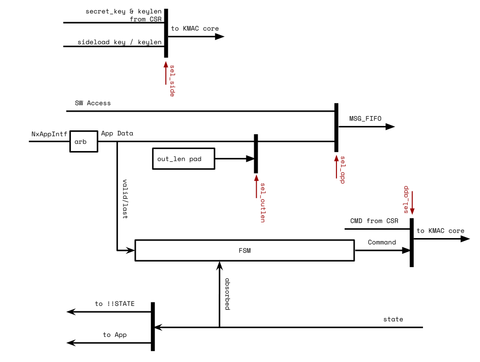
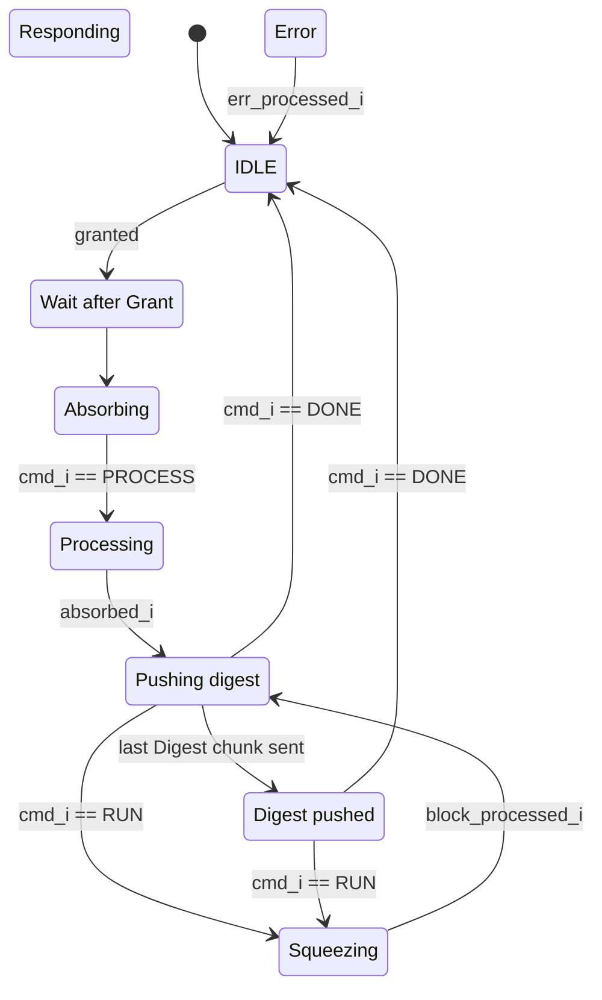

# Theory of Operation

## Block Diagram


The above figure shows the KMAC/SHA3 HWIP block diagram.
The KMAC has register interfaces for SW to configure the module, initiate the hashing process, and acquire the result digest from the STATE memory region.
It also has a sideload interface to the KeyMgr to get the secret key (masked).
The IP has N x [simple application interfaces](#simple-application-interface), which allows other HWIPs to perform a pre-defined hashing operation.
It also features M x [command-based application interfaces (CmdApp)](#command-based-application-interface), which gives other HWIPs similar control over the KMAC HWIP as the software has.

Similar to HMAC, the KMAC HWIP also has a message FIFO (MSG_FIFO) whose depth was determined based on a few criteria such as the register interface width, and its latency, the latency of hashing algorithm (Keccak).
Based on the given criteria, the MSG_FIFO depth was determined to store the incoming message while the SHA3 core is processing the message parts.

To support partial writes, the MSG_FIFO has a packer in front which packs writes to the size of the internal datapath (64bit).It frees the software from having to align the messages and it also simplifies the app interface when the message length must be appended (for KMAC operation).

> Note that both the SW and simple application interface only support plain data, i.e., shares are not supported.
> The command-based application interface supports shared data (2 shares) but bypasses the MSG_FIFO and the packer.

The fed message data goes into the KMAC core regardless whether the hashing operation is KMAC or not.
The KMAC core forwards the messages to SHA3 core in case KMAC hash functionality is disabled.
When performing a KMAC operation, the KMAC core prepends the encoded secret key as described in the SHA3 Derived Functions specification.
It is expected that the software writes the encoded output length at the end of the message.
For hashing operations triggered by an IP through the application interface, the encoded output length is appended inside the AppIntf module in the KMAC HWIP.

KMAC/SHA3 HWIP has an option to receive the secret key from the KeyMgr via sideload key interface.
The software should set [`CFG_SHADOWED.sideload`](registers.md#cfg_shadowed) to use the KeyMgr sideloaded key for the SW and CmdApp-initiated KMAC operation (or enable/configure it in the application interface configuration).
`keymgr_pkg::hw_key_t` defines the structure of the sideloaded key.
KeyMgr provides the sideloaded key in two-share masked form regardless of the compile-time parameter `EnMasking`.
If `EnMasking` is not defined, the KMAC converts the shared key to the unmasked form before uses the key.

The SHA3 core is the main Keccak processing module.
It supports SHA3 hashing functions, SHAKE128, SHAKE256 extended output functions, and also cSHAKE128, cSHAKE256 functions in order to support KMAC operation.
To support multiple hashing functions, it has the padding logic inside.
The padding logic mainly pads the predefined bits at the end of the message and also performs `pad10*1()` function.
If cSHAKE mode is set, the padding logic also prepends the encoded function name `N` and the customization string `S` prior to the incoming messages according to the spec requirements.

Both the internal state width and the masking of the Keccak core are configurable via compile-time Verilog parameters.
By default, 1600 bits of internal state are used and stored in two shares (1st order masking).
The masked Keccak core takes 4 clock cycles per round if sufficient entropy is available.
If desired, the masking can be disabled and the internal state width can be reduced to 25, 50, or 100 bits at compile time.

## Design Details

### Keccak Round

A Keccak round implements the Keccak_f function described in the SHA3 specification.
Keccak round logic in KMAC/SHA3 HWIP not only supports 1600 bit internal states but also all possible values {50, 100, 200, 400, 800, 1600} based on a parameter `Width`.
If masking is disabled via compile-time Verilog parameter `EnMasking`, also 25 can be selected as state width.
Keccak permutations in the specification allow arbitrary number of rounds.
This module, however, supports Keccak_f which always runs `12 + 2*L` rounds, where $$ L = log_2 {( {Width \over 25} )} $$ .
For instance, 200 bits of internal state run 18 rounds.
KMAC/SHA3 instantiates the Keccak round module with 1600 bit.


Keccak round logic has two phases inside.
Theta, Rho, Pi functions are executed at the 1st phase.
Chi and Iota functions run at the 2nd phase.
If the compile-time Verilog parameter `EnMasking` is not set, i.e., if masking is not enabled, the first phase and the second phase run at the same cycle.

If masking is enabled, the Keccak round logic stores the intermediate state after processing the 1st phase.
The stored values are then fed into the 2nd phase computing the Chi and Iota functions.
The Chi function leverages first-order [Domain-Oriented Masking (DOM)](https://eprint.iacr.org/2017/395.pdf) to deter SCA attacks.

To balance circuit area and SCA hardening, the Chi function uses 800 instead 1600 DOM multipliers but the multipliers are fully pipelined.
The Chi and Iota functions are thus separately applied to the two halves of the state and the 2nd phase takes in total three clock cycles to complete.
In the first clock cycle of the 2nd phase, the first stage of Chi is computed for the first lane halves of the state.
In the second clock cycle, the new first lane halves are output and written to state register.
At the same time, the first stage of Chi is computed for the second lane halves.
In the third clock cycle, the new second lane halves are output and written to the state register.

The 800 DOM multipliers need 800 bits of fresh entropy for remasking.
If fresh entropy is not available, the DOM multipliers do not move forward and the 2nd phase will take more than three clock cycles.
Processing a Keccak_f (1600 bit state) takes a total of 96 cycles (24 rounds X 4 cycles/round) including the 1st and 2nd phases.

If the masking compile time option is enabled, Keccak round logic requires an additional 3200 flip flops to store the intermediate half state inside the 800 DOM multipliers.
In addition to that Keccak round logic needs two sets of the same Theta, Rho, and Pi functions.
As a result, the masked Keccak round logic takes more than twice as much as area than the unmasked version of it.

### Padding for Keccak

Padding logic supports SHA3/SHAKE/cSHAKE algorithms.
cSHAKE needs the extra inputs for the Function-name `N` and the Customization string `S`.
Other than that, SHA3, SHAKE, and cSHAKE share similar datapath inside the padding module except the last part added next to the end of the message.
SHA3 adds `2'b 10`, SHAKE adds `4'b 1111`, cSHAKE adds `2'b00` then `pad10*1()` follows.
All are little-endian values.

Interface between this padding logic and the MSG_FIFO follows the conventional FIFO interface.
So `prim_fifo_*` can talk to the padding logic directly.
This module talks to Keccak round logic with a more memory-like interface.
The interface has an additional address signal on top of the valid, ready, and data signals.


The hashing process begins when the software issues the start command to [`CMD`](registers.md#cmd) .
If cSHAKE is enabled, the padding logic expands the prefix value (`N || S` above) into a block size.
The block size is determined by the [`CFG_SHADOWED.kstrength`](registers.md#cfg_shadowed) .
If the value is 128, the block size will be 168 bytes.
If it is 256, the block size will be 136 bytes.
The expanded prefix value is transmitted to the Keccak round logic.
After sending the block size, the padding logic triggers the Keccak round logic to run a full 24 rounds.

If the mode is not cSHAKE, or cSHAKE mode and the prefix block has been processed, the padding logic accepts the incoming message bitstream and forward the data to the Keccak round logic in a block granularity.
The padding logic controls the data flow and makes the Keccak logic to run after sending a block size.

After the software writes the message bitstream, it should issue the Process command into [`CMD`](registers.md#cmd) register.
The padding logic, after receiving the Process command, appends proper ending bits with respect to the [`CFG_SHADOWED.mode`](registers.md#cfg_shadowed) value.
The logic writes 0 up to the block size to the Keccak round logic then ends with 1 at the end of the block.


After the Keccak round completes the last block, the padding logic asserts an `absorbed` signal to notify the software.
The signal generates the `kmac_done` interrupt.
At this point, the software is able to read the digest in [`STATE`](registers.md#state) memory region.
If the output length is greater than the Keccak block rate in SHAKE and cSHAKE mode, the software may run the Keccak round manually by issuing Run command to [`CMD`](registers.md#cmd) register.

The software completes the operation by issuing Done command after reading the digest.
The padding logic clears internal variables and goes back to Idle state.

### Padding for KMAC


KMAC core prepends and appends additional bitstream on top of Keccak padding logic in SHA3 core.
The [NIST SP 800-185](https://csrc.nist.gov/publications/detail/sp/800-185/final) defines `KMAC[128,256](K, X, L, S)` as a cSHAKE function.
See the section 4.3 in NIST SP 800-185 for details.
If KMAC is enabled, the software should configure [`CMD.mode`](registers.md#cmd) to cSHAKE and the first six bytes of [`PREFIX`](registers.md#prefix) to `0x01204B4D4143` (bigendian).
The first six bytes of [`PREFIX`](registers.md#prefix) represents the value of `encode_string("KMAC")`.

The KMAC padding logic prepends a block containing the encoded secret key to the output message.
The KMAC first sends the block of secret key then accepts the incoming message bitstream.
At the end of the message, the software writes `right_encode(output_length)` to MSG_FIFO prior to issue Process command.

### Message FIFO

The KMAC HWIP has a compile-time configurable depth message FIFO inside.
The message FIFO receives incoming message bitstream regardless of its byte position in a word.
Then it packs the partial message bytes into the internal 64 bit data width.
After packing the data, the logic stores the data into the FIFO until the internal KMAC/SHA3 engine consumes the data.

#### FIFO Depth calculation

The depth of the message FIFO is chosen to cover the throughput of the software or other producers such as DMA engine.
The size of the message FIFO is enough to hold the incoming data while the SHA3 engine is processing the previous block.
Details are in `kmac_pkg::MsgFifoDepth` parameter.
Default design parameters assume the system characteristics as below:

- `kmac_pkg::RegLatency`: The register write takes 5 cycles.
- `kmac_pkg::Sha3Latency`: Keccak round latency takes 96 cycles, which is the masked version of the Keccak round.

#### Empty and Full status

Under normal operating conditions, the SHA3 engine will process data a lot faster than software can push it to the Message FIFO.
The Message FIFO depth observable from [`STATUS.fifo_depth`](registers.md#status--fifo_depth) will remain **0** while the [`STATUS.fifo_empty`](registers.md#status--fifo_empty) status bit is lowered for one clock cycle whenever software provides new data.

However, if the SHA3 engine is currently busy or if the KMAC block is waiting for fresh entropy from EDN, the Message FIFO may actually run full (indicated by the `fifo_full` status bit).
Resolving these conditions may take hundreds of cycles or more.
After the SHA3 engine starts popping the data again, the Message FIFO will eventually run empty again and the `fifo_empty` status interrupt will fire.
Note that the `fifo_empty` status interrupt will not fire if i) one of the hardware application interfaces is using the KMAC block, ii) the SHA3 core is not in the `Absorb` state, or iii) after software has written the `Process` command.

If software pushes data to the Message FIFO while it is full, the write operation is blocked until there is again space in the FIFO.
This means the processor is effectively stalled.
If the SHA3 engine is currently running and software fills up the Message FIFO, the resulting stall won't take more than 100 clock cycles.
The stall mechanism prevents data loss and the upper bound on the wait time avoids software needing to poll the [`STATUS.fifo_depth`](registers.md#status--fifo_depth) field before writing data.

However, the FIFO can also become full because the KMAC block is waiting for fresh entropy from EDN.
Resolving this condition can take much longer, and it can even result in deadlocking the system if the following conditions are met:
1. Software attempts to push data to the Message FIFO while it is full.
1. The fresh entropy is not delivered and the value of the [`ENTROPY_PERIOD`](registers.md#entropy_period) register is 0, meaning the wait timer never expires.

The entropy not getting delivered in time can in particular happen if the entropy complex or parts of it are disabled, e.g., [to save power](../../csrng/doc/programmers_guide.md#running-csrng-with-entropy_src-disabled).
Refer to [Preventing potential deadlocks in EDN mode](programmers_guide.md#preventing-potential-deadlocks-in-edn-mode) for guidance on how to safely avoid this scenario.


#### Masking

The message FIFO does not generate the masked message data.
Incoming message bitstream is not sensitive to the leakage.
If the `EnMasking` parameter is set and [`CFG_SHADOWED.msg_mask`](registers.md#cfg_shadowed) is enabled, the message is masked upon loading into the Keccak core using the internal entropy generator.
The secret key, however, is stored as masked form always.

If the `EnMasking` parameter is not set, the masking is disabled.
Then, the software has to provide the key in unmasked form by default.
Any write operations to [`KEY_SHARE1_0`](registers.md#key_share1) - [`KEY_SHARE1_15`](registers.md#key_share1) are ignored.

If the `EnMasking` parameter is not set and the `SwKeyMasked` parameter is set, software has to provide the key in masked form.
Internally, the design then unmasks the key by XORing the two key shares together when loading the key into the engine.
This is useful when software interface compatibility between the masked and unmasked configuration is desirable.

If the `EnMasking` parameter is set, the `SwKeyMasked` parameter has no effect: Software always provides the key in two shares.

### Keccak State Access

After the Keccak round completes the KMAC/SHA3 operation, the contents of the Keccak state contain the digest value.
The software can access the 1600 bit of the Keccak state directly through the window of the KMAC/SHA3 register.

If the compile-time parameter masking feature is enabled, the upper 256B of the window is the second share of the Keccak state.
If not, the upper address space is zero value.
The software reads both of the Keccak state shares and XORed in the software to get the unmasked digest value if masking feature is set.

The Keccak state is valid after the sponge absorbing process is completed.
While in an idle state or in the sponge absorbing stage, the value is zero.
This ensures that the logic does not expose the secret key XORed with the keccak_f results of the prefix to the software.
In addition to that, the KMAC/SHA3 blocks the software access to the Keccak state when it processes the request from KeyMgr for Key Derivation Function (KDF).

### Application Interfaces

The KMAC features two types of application interfaces so different hardware blocks have direct access to the KMAC core.
- The simple application interface allows a hardware block to perform a fixed type of hashing and can only retrieve one hash.
  The hashing configuration (type, strength, etc.) is a compile-time parameter and this interface does not support shared message data, i.e., there is only one 64-bit data path.
  The input data is however fed through the message FIFO and its packer.
- The command-based application interface can configure the type of hashing at runtime and allows to dispatch commands similarly how SW can control the KMAC HWIP.
  This allows to operate the KMAC HWIP in the eXtendable-Output-Function (XOF) mode.

#### Simple application interface



The IP has N simple application interfaces.
The apps connected to the KMAC IP may initiate the SHA3/cSHAKE/KMAC hashing operation via the application interface `kmac_pkg::app_{req|rsp}_t`.
The type of the hashing operation is determined by the compile-time parameter `kmac_pkg::AppCfg`.
This parameter also controls whether the prefix is defined at compile-time or the prefix should be taken from the [`PREFIX`](registers.md#prefix) CSR.

| Index | App      | Algorithm | Prefix
|:-----:|:--------:|:---------:|------------
| 0     | KeyMgr   | KMAC256   | "KMAC"
| 1     | LC_CTRL  | cSHAKE128 | "LC_CTRL"
| 2     | ROM_CTRL | cSHAKE256 | "ROM_CTRL"

In the current version of IP, the IP has three application interfaces, which are KeyMgr, LC_CTRL, and ROM_CTRL.
KeyMgr uses the KMAC operation and the prefix is defined by a compile-time parameter.
LC_CTRL and ROM_CTRL use the cSHAKE operation with prefixes defined by a compile-time parameter.

The app sends 64-bit data (`MsgWidth`) in a beat with the message strobe signal.
The state machine inside the AppIntf logic starts when it receives the first valid data from any of the AppIntf.
The AppIntf module chooses the winner based on the fixed priority.
Then it forwards the selected App to the next stage and generates the required commands.
Because this logic sees the first valid data as an initiator, the Apps cannot run the hashing operation with an empty message.
After the logic switches to accept the message bitstream from the selected App, if the hashing operation is KMAC, the logic forces the sideloaded key to be used as a secret.
As long as an app interface is active, any command issued from the software is ignored.

The last beat of the App data moves the state machine to append the encoded output length if the hashing operation is KMAC.
The output length depends on the compile-time selected digest width and is sent in a separate beat.
The packer in the MSG_FIFO then assembles this to a full message.

After the encoded output length is pushed to the KMAC core, the interface logic issues a Process command to run the hashing logic.

After hashing operation is completed, KMAC does not raise a `kmac_done` interrupt; rather it triggers the `done` status in the App response channel.
The result digest always comes in two shares.
If the `EnMasking` parameter is not set, the second share is always zero.

In case of an error, the simple application raises the error flag of the response channel but continues operation and returns garbage data.
This ensures the KMAC HWIP is returned into idle mode and is ready to serve the next request.

### Command-based application interface
The interface consists of a request and response channel.
Over the request channel an application can send commands and data.
The interface responds to the commands or sends back the digest data via the response channel.
Both channels are valid/ready handshaked and can be fully pipelined.
> The request and response channel are designed such that there is NO valid locked-in requirement, meaning an application can withdraw a request at any time.
> This is required as an application sending commands can potentially crash unexpectedly, e.g., when OTBN escalates due to a detected fault.

```wavejson
{
  signal: [
    ['Request',
    {name: 'req_valid',   wave: '10.'},
    {name: 'req_ready',   wave: '101'},
    {name: 'req_is_data', wave: '0x.'},
    {name: 'data_s0',     wave: '3x.', data: ["CMD"]},
    {name: 'data_s1',     wave: '3x.', data: 'data'},
    {name: 'strb',        wave: 'x..'},
    ],
    {},
    ['Response',
    {name: 'rsp_valid',   wave: '010'},
    {name: 'rsp_ready',   wave: '1..'},
    {name: 'rsp_is_data', wave: 'x0x'},
    {name: 'digest_s0',   wave: 'x3x', data: ["ACK / ERR"]},
    {name: 'digest_s1',   wave: 'x3x', data: 'info'},
    ],
  ],
  edge: [],
  foot:{
   tock:0
 },
 config:{hscale:2},
}
```

There are the following commands available:
- START
  - This command is used to claim the KMAC interface and send the desired hashing configuration.
  - The CmdApp will check the sent configuration and if it is valid will wait until the KMAC is idle.
  - Once KMAC is claimed, the CmdApp will send an acknowledge response. The application can now send the message.
  - If the configuration is invalid, an error response is sent back. The CmdApp won't place a claim request.
- PROCESS
  - Once the complete message has been transferred, the app has to send a PROCESS command.
  - The KMAC will then compute the first hash.
  - There is no acknowledgement response for the PROCESS command.
  - As soon as the hash is available, the CmdApp places data responses on the response channel.
  - It pushes the digest data until the whole rate is sent.
- RUN
  - The app can send a RUN command at any time after the PROCESS command.
  - The CmdApp acknowledges a RUN command by placing a response on the response channel.
  - The connecting app is responsible to discard any in-flight data responses until the RUN acknowledgement is received.
    This can happen if the app did send the RUN command before it received all digest responses.
  - While KMAC is computing the next hash part, all requests are stalled.
- DONE
  - At any time after the PROCESS or RUN command a DONE command releases the KMAC claim.
  - The app is responsible to drain the response channel until it receives the ACK for the DONE command.


The full process is shown in the following wave.
```wavejson
{
  signal: [
    {name: 'CmdApp state',wave: '222......2.2..2.2..2.2.', data: ["Idle","WaG","Aborbing","Processing","Pushing","Pushed","Squeezing","Pushing","Idle"]},
    {},
    ['Request',
    {name: 'req_valid',   wave: '1........0.....10...10.'},
    {name: 'req_ready',   wave: '101.0.1..0.1....0..1...',
                          node: '....a.b..c.d....g..h...'},
    {name: 'req_is_data', wave: '01......0x.....0x......'},
    {name: 'data_s0',     wave: '32.22..23x.....3x...3x.', data: ["START", "", "", "", "", "PRC", "RUN", "DONE"]},
    {name: 'data_s1',     wave: 'x2.22..2x..............'},
    {name: 'strb',        wave: 'x2.....2x..............', data: '0xFF 0x01'},
    ],
    {},
    ['Response',
    {name: 'rsp_valid',   wave: '10......10.1..010..1.0.',
                          node: '...........e..f........'},
    {name: 'rsp_ready',   wave: '1......................'},
    {name: 'rsp_is_data', wave: '0x......0x.1..x0x..10x.'},
    {name: 'digest_s0',   wave: '3x......3x.222x3x..23x.', data: ["ACK", "ACK", "", "", "", "ACK", "", "ACK"]},
    {name: 'digest_s1',   wave: 'x..........222x....2x..'},
    ],
  ],
  edge: [
    'a~b rate full', 'c~d processing', 'e~f pushing digest', 'g~h squeezing'
  ],
  foot:{
   tock:0
 },
 config:{hscale:1},
}
```

When sending the start command, the desired hashing configuration is sent along.
The following configuration must be provided by the app (usually residing in CFG_SHADOWED):
- mode: select the keccak hashing mode
- kstrength: select the strength
- kmac_en: If 1 prepend the key to the message / operate in kmac mode
- en_unsupported_modestrength: In case such a configuration is desired
- msg_mask: If 1, the message is masked if mode is KMAC. Keep it for full flexibility

The following configuration must be set by SW prior the CmdApp can be used:
- entropy_ready: Only SW because SW must set this up
- entropy_mode: Only SW because SW must set this up
- entropy_fast_process: Should be deactivated. Set by Ibex?
- sideload: Whether to use the Key from the Regs or Keymgr if performing a KMAC operation. Only SW because SW must provide the key.
- prefix (for cSHAKE or KMAC): The software must write the desired prefix to this register.
  The prefix from the CSR is used by the CmdApp for cSHAKE operation.
  For KMAC operations, the CmdApp uses a fixed prefix ("KMAC" and the empty customization string).
  This avoids that we have to check the prefix for correctness as "KMAC" is required by the standard.

> It is the responsibility of the SW managing the system to ensure this configuration is set prior an application makes use of the CmdApp interface.

The following configuration options are irrelevant as they have no effect:
- state_endianness: Only affects SW
- msg_endianness: Only affects SW

#### Interface details

Internally, the interface has the following FSM:



The `Error` state is terminal until the KMAC gets reset by SW.
SW can clear non fatal errors by reading the error state and writing the `err_processed` bit.
Any state can transition into the error state.

The special state `Responding` handles the backpressure of the response channel as described below.
The transitions into and out of this state are not drawn for clarity.

##### Handling response backpressure
Backpressure on the response channel can arise, for example, if an application currently cannot accept responses because the next digest part cannot yet be processed.
In this case the CmdApp transitions into the `Responding` state and waits until the pending response is accepted.
During this waiting state any new request is stalled.
Once the response is handshaked, the CmdApp transitions into the next state.


An example where the acknowledgement of the START command is delayed is shown below.
```wavejson
{
  signal: [
    {name: 'CmdApp',     wave: '22...22..', data: ["Idle","Responding","WaG","Absorbing","Pushing","Pushed","Squeezing","Pushing","Idle"]},
    {},
    ['Request',
    {name: 'req_valid',   wave: '1........'},
    {name: 'req_ready',   wave: '10....1..'},
    {name: 'req_is_data', wave: '01.......'},
    {name: 'data_s0',     wave: '32.....22', data: ["START"]},
    {name: 'data_s1',     wave: 'x2.....22'},
    {name: 'strb',        wave: 'x2.......', data: '0xFF 0x01'},
    ],
    {},
    ['Response',
    {name: 'rsp_valid',   wave: '1.....0..'},
    {name: 'rsp_ready',   wave: '0....1...'},
    {name: 'rsp_is_data', wave: '0.....x..'},
    {name: 'digest_s0',   wave: '3.....x..', data: ["ACK", "ACK", "", "", "", "ACK", "", "ACK"]},
    {name: 'digest_s1',   wave: 'x........'},
    ],
  ],
  edge: [],
  foot:{
   tock:0
 },
 config:{hscale:1},
}
```

Not all states can generate responses.
The states capable of producing a response are:
- Idle
- Absorbing
- Pushing Digest
- Digest Pushed

Most responses are sent when transitioning into the next state.
Thus, after a delayed response is sent, the state machine can directly jump to the next state which is specified when the response is placed for the first time.
Therefore, from the Responding state the following states are reachable:
- Idle
- Absorbing
- Pushing Digest
- Digest Pushed

##### Delayed START command because KMAC is not ready
In case the KMAC is not idle when a START command arrives the interface tries to acquire the KMAC until either the interface withdraws its request or it succeeds.
```wavejson
{
  signal: [
    {name: 'CmdApp',     wave: '2.......22..', data: ["Idle","WaG","Absorbing","Pushing","Pushed","Squeezing","Pushing","Idle"]},
    {},
    ['Request',
    {name: 'req_valid',   wave: '1.0..1......'},
    {name: 'req_ready',   wave: '0......101..'},
    {name: 'req_is_data', wave: '0.x..0..1...'},
    {name: 'data_s0',     wave: '3.x..3..2.22', data: ["START","START"]},
    {name: 'data_s1',     wave: 'x.......2.22'},
    {name: 'strb',        wave: 'x.......2...', data: '0xFF 0x01'},
    ],
    {},
    ['Response',
    {name: 'rsp_valid',   wave: '0......10...'},
    {name: 'rsp_ready',   wave: '1...........'},
    {name: 'rsp_is_data', wave: 'x......0xx..'},
    {name: 'digest_s0',   wave: 'x......3x...', data: ["ACK"]},
    {name: 'digest_s1',   wave: 'x...........'},
    ],
  ],
  edge: [],
  foot:{
   tock:0
 },
 config:{hscale:1},
}
```

##### Sending a DONE or RUN command
When the KMAC is pushing the digest, the app can at any point in time send a DONE or RUN command.
If this command arrives before all digest responses are handshaked, its acknowledge response is immediately sent back.
This discards any pending data response and thus the response channel does not guarantee that the data is stable once the valid has been asserted.
An example is shown below and in cycle 5 the `digest_s0` is changed despite a pending data response has not yet been handshaked.

```wavejson
{
  signal: [
    {name: 'CmdApp',     wave: '2....2..2.', data: ["Pushing","Responding","Idle","Pushing","Pushed","Squeezing","Pushing","Idle"]},
    {},
    ['Request',
    {name: 'req_valid',   wave: '0....1....'},
    {name: 'req_ready',   wave: '0....10...'},
    {name: 'req_is_data', wave: 'x....0x...'},
    {name: 'data_s0',     wave: 'x....3x...', data: ["DONE"]},
    {name: 'data_s1',     wave: 'x.........'},
    {name: 'strb',        wave: 'x.........', data: '0xFF 0x01'},
    ],
    {},
    ['Response',
    {name: 'rsp_valid',   wave: '1.......0.'},
    {name: 'rsp_ready',   wave: '10.....1..'},
    {name: 'rsp_is_data', wave: '1....0..x.'},
    {name: 'digest_s0',   wave: '22...3..x.', data: ["","","ACK"]},
    {name: 'digest_s1',   wave: '22...x....'},
    ],
  ],
  edge: [],
  foot:{
   tock:0
 },
 config:{hscale:1},
}
```

#### Error handling
If there occurs an error, either because the CmdApp receives an invalid command or there is an internal KMAC error like an entropy problem, the CmdApp sends an error response back to the application.
Errors caused by the application do not affect the CmdApp state.
KMAC internal errors however will set the CmdApp into the error state and only SW can recover it.
In this error state all commands are discarded and an error response is returned.

- Application errors:
  - The application sends a START command with invalid configuration
    - The CmdApp responds with an error response and does not claim the KMAC hardware.
  - The entropy is not ready when receiving a START command
    - The CmdApp responds with an error response and does not claim the KMAC hardware.
  - The application violates the command order.
    - If the applications sends, e.g., a DONE command before a PROCESS command, the command is ignored and the CmdApp responds with an error.
      The CmdApp stays in the current state.

- KMAC internal errors:
  - A fatal alert is raised:
    - shadowed_storage_err: The configuration CSR is attacked.
    - alert_intg_err: Register file detects an integrity error
    - sparse_fsm_error: A FSM enters an invalid state.
    - counter_error: Any of the internal prim counters detects an error
    - control_integrity_error: SHA3 core detects an error on its storage (state)
  - Other error sources which are reported to the error register and raise an error interrupt:
    - sha3_err: Asserted if SHA3 core detects an invalid command.
      Relevant to check because commands could be FIed.
    - app_err:
      - FSM error: Asserted if key from KeyMgr is used but it is not valid (StKeyMgrErrKeyNotValid).
        Must be handled.
      - MUX error:
        - SW issues command when app is active.
        - SW pushed message when not in SW state.
        - Both errors have no effect on the correctness of the result for the app interface.
          Thus save to ignore but still tracked as baked into app_err and fsm error must be handled.
    - entropy_err: Asserted if there is an entropy problem like the wait timer expired or the wrong entropy mode is configured.
      Must be handled.
      Does not factor into any other error!
    - errchecker_err: SW sends invalid command, prefix is wrong, configuration is invalid, or entropy not ready.
      Has no effect on CmdApp, save to ignore.
    - msgfifo_err: Asserted if an integrity error for the packer or fifo arises.
      msg fifo should be bypassed / is not used for CmdApp.
      Could be ignored but anyway factors into the fatal counter_error.
  - Irrelevant errors:
    - shadowed_update_err: Asserted if there is a problem when SW updates the configuration.
      Not relevant as only triggerable by SW.

Any KMAC internal error will raise the error interrupt.
As of this, we also response all of these errors back to the application.
Even if some of these errors could be ignored, we handle all errors to be consistent regarding the information the SW sees.
It would be confusing if an error is not reported via the CmdApp interface but the interrupt to SW is raised and the error register shows that an error occurred.

##### Error recovery
If an error occurs, the CmdApp transitions into an error state and cannot recover the KMAC.
Only SW can recover the KMAC and so reset the CmdApp state.
The reasons are:
- Some errors cannot be resolved by the CmdApp as it cannot set the key for example.
- If an error occurs the entropy is not ready anymore.
  It is not sensible that the CmdApp can set the entropy ready as this requires more system state information which only SW has.

When the SW recovers the KMAC, the following signals are of interest to bring back the CmdApp to Idle.
- err_processed: This signal is pulsed when SW writes to this bit to indicate that SW has read the error reason and handled accordingly.
  It resets the state.
- clear_after_error: kmac_app sets this when it has successfully reset the KMAC core state back to idle.
  It resets the errchk state only.

#### Recovering KMAC when application crashes
If the application controlling the CmdApp unexpectedly crashes, the KMAC would reside for ever in the CmdApp state.
To gracefully recover the KMAC without triggering the hardware reset, SW can take over control of KMAC by writing to the SW takeover bit.
When this bit is written, the KMAC transfers ownership from the CmdApp to the SW.
SW then can properly bring back the KMAC to the idle state by issuing the required commands.

### Entropy Generator

This section explains the entropy generator inside the KMAC HWIP.

KMAC has an entropy generator to provide the design with pseudo-random numbers while processing the secret key block.
The entropy is used for both remasking the DOM multipliers inside the Chi function of the Keccak core as well as for masking the message if [`CFG_SHADOWED.msg_mask`](registers.md#cfg_shadowed) is enabled.

The entropy generator is constructed using a [heavily unrolled Bivium stream cipher primitive](https://eprint.iacr.org/2023/1134).
This allows the module to generate 800 bits of fresh, pseudo-random numbers required by the 800 DOM multipliers for remasking in every clock cycle.

Depending on [`CFG_SHADOWED.entropy_mode`](registers.md#cfg_shadowed), the entropy generator fetches initial entropy from the [Entropy Distribution Network (EDN)][edn] module or software has to provide a seed by writing the [`ENTROPY_SEED`](registers.md#entropy_seed) register 9 times.
The module periodically refreshes the PRNG seed with fresh entropy from EDN.
Software can explicitly request a complete reseed of the PRNG state from EDN through [`CMD.entropy_req`](registers.md#cmd).

[edn]: ../../edn/README.md

### Error Report

This section explains the errors KMAC HWIP raises during the hashing operations, their meanings, and the error handling process.

KMAC HWIP has the error checkers in its internal datapath.
If the checkers detect errors, whether they are triggered by the SW mis-configure, or HW malfunctions, they report the error to [`ERR_CODE`](registers.md#err_code) and raise an `kmac_error` interrupt.
Each error code gives debugging information at the lower 24 bits of [`ERR_CODE`](registers.md#err_code).

Value | Error Code | Description
------|------------|-------------
0x01  | KeyNotValid | In KMAC mode with the sideloaded key, the IP raises an error if the sideloaded secret key is not ready.
0x02  | SwPushedMsgFifo | MsgFifo is updated while not being in the Message Feed state.
0x03  | SwIssuedCmdInAppActive | SW issued a command while the application interface is being used
0x04  | WaitTimerExpired | EDN has not responded within the wait timer limit.
0x05  | IncorrectEntropyMode | When SW sets `entropy_ready`, the `entropy_mode` is neither SW nor EDN.
0x06  | UnexpectedModeStrength | SHA3 mode and Keccak Strength combination is not expected.
0x07  | IncorrectFunctionName | In KMAC mode, the PREFIX has the value other than `encoded_string("KMAC")`
0x08  | SwCmdSequence | SW does not follow the guided sequence, `start` -> `process` -> {`run` ->} `done`
0x09  | SwHashingWithoutEntropyReady | SW requests KMAC op without proper config of Entropy in KMAC. This error occurs if KMAC IP masking feature is enabled.
0x80  | Sha3Control | SW may receive Sha3Control error along with `SwCmdSequence` error. Can be ignored.

#### KeyNotValid (0x01)

The `KeyNotValid` error is raised in the application interface module.
When a KMAC application requests a hashing operation, the module checks if the sideloaded key is ready.
If the key is not ready, the module reports `KeyNotValid` error and moves to dead-end state and waits the IP reset.

This error does not provide any additional information.

#### SwPushedMsgFifo (0x02)

The `SwPushedMsgFifo` error happens when the Message FIFO receives TL-UL transactions while the application interface is busy.
The Message FIFO drops the request.

The IP reports the error with an info field.

Bits    | Name        | Description
--------|-------------|-------------
[23:16] | reserved    | all zero
[15:8]  | kmac_app_st | KMAC_APP FSM state.
[7:0]   | mux_sel     | Current APP Mux selection. 0: None, 1: SW, 2: App

#### SwIssuedCmdInAppActive (0x03)

If the SW issues any commands while the application interface is being used, the module reports `SwIssuedCmdInAppActive` error.
The received command does not affect the Application process.
The request is dropped by the KMAC_APP module.

The lower 3 bits of [`ERR_CODE`](registers.md#err_code) contains the received command from the SW.
#### WaitTimerExpired (0x04)

The timer values set by SW is internally used only when pending EDN request is completed.
Therefore, dynamically changing wait timer cannot be used as a way to poke the timer out of a stalling EDN request.
If a non-zero timer expires, the module cancels the transaction and reports the `WaitTimerExpired` error.

When this error happens, the state machine in KMAC_ENTROPY module moves to Wait state.
In that state, it keeps using the pre-generated entropy and asserting the entropy valid signal.
It asserts the entropy valid signal to complete the current hashing operation.
If the module does not complete, or flush the pending operation, it creates the back pressure to the message FIFO.
Then, the SW may not be able to access the KMAC IP at all, as the crossbar is stuck.

The SW may move the state machine to the reset state by issuing [`CMD.err_processed`](registers.md#cmd).

#### IncorrectEntropyMode (0x05)

If SW misconfigures the entropy mode and let the entropy module prepare the random data, the module reports `IncorrectEntropyMode` error.
The state machine moves to Wait state after reporting the error.

The SW may move the state machine to the reset state by issuing [`CMD.err_processed`](registers.md#cmd).

#### UnexpectedModeStrength (0x06)

When the SW issues `Start` command, the KMAC_ERRCHK module checks the [`CFG_SHADOWED.mode`](registers.md#cfg_shadowed) and [`CFG_SHADOWED.kstrength`](registers.md#cfg_shadowed).
The KMAC HWIP assumes the combinations of two to be **SHA3-224**, **SHA3-256**, **SHA3-384**, **SHA3-512**, **SHAKE-128**, **SHAKE-256**, **cSHAKE-128**, and **cSHAKE-256**.
If the combination of the `mode` and `kstrength` does not fall into above, the module reports the `UnexpectedModeStrength` error.

However, the KMAC HWIP proceeds the hashing operation as other combinations does not cause any malfunctions inside the IP.
The SW may get the incorrect digest value.

#### IncorrectFunctionName (0x07)

If [`CFG_SHADOWED.kmac_en`](registers.md#cfg_shadowed) is set and the SW issues the `Start` command, the KMAC_ERRCHK checks if the [`PREFIX`](registers.md#prefix) has correct function name, `encode_string("KMAC")`.
If the value does not match to the byte form of `encode_string("KMAC")` (`0x4341_4D4B_2001`), it reports the `IncorrectFunctionName` error.

As same as `UnexpectedModeStrength` error, this error does not block the hashing operation.
The SW may get the incorrect signature value.

#### SwCmdSequence (0x08)

The KMAC_ERRCHK module checks the SW issued commands if it follows the guideline.
If the SW issues the command that is not relevant to the current context, the module reports the `SwCmdSequence` error.
The lower 3bits of the [`ERR_CODE`](registers.md#err_code) contains the received command.

This error, however, does not stop the KMAC HWIP.
The incorrect command is dropped at the following datapath, SHA3 core.
